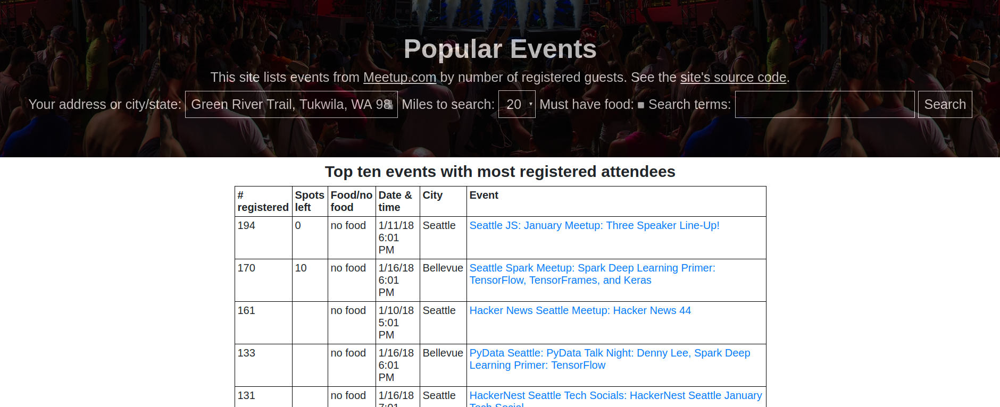
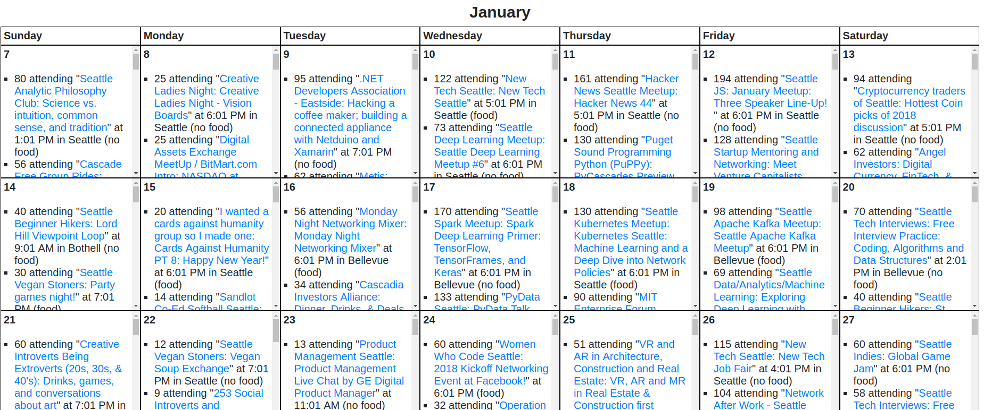

# The Popular Events
> Lists top ten events based on location and topic search and the number of
> reservations each event has. Also has a "must have food" filter.

See https://events.pythonwebcoder.com

